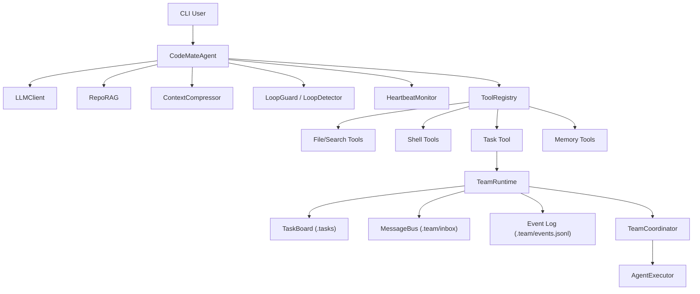

# Oh-My-Claw


> 一只会写代码、会看日志、会盯进度的工程猫爪助手。  
> 目标不是“聊得精彩”，而是“把任务做完”。

---

## 先讲个故事（这个项目是怎么来的）

某次线上事故复盘，我们把 AI 助手拉进来一起排查。它给建议非常快，看起来也“很对”，但真实落地时连环翻车：

- 说得头头是道，真正改文件就犹豫
- 能给命令，但执行链路不稳定
- 对话一长就忘上下文
- 出错后没有证据链，复盘几乎靠猜

那天我们定了一个很硬的标准：

1. AI 必须能执行，不只会建议  
2. 长任务不能失忆，必须有上下文治理  
3. 每一步都要可追溯，方便复盘和验收

于是有了 **Oh-My-Claw**。  
“Claw” 不是卖萌，它代表的是：**要有爪子，能落地。**

---

## 3 分钟速读

| 你关心什么 | Oh-My-Claw 怎么做 |
|---|---|
| 能不能真的改代码？ | `LLM -> Tool -> Result -> LLM` 的执行闭环，工具直接落地 |
| 长任务会不会崩？ | Micro / Auto / Manual 三层压缩 + RepoRAG 检索注入 |
| 团队流程怎么管？ | `lead / researcher / builder / reviewer` 角色化协作 |
| 出问题能复盘吗？ | trace + metrics + events + task board 全链路可追踪 |

---

## 一个真实任务场景

你接手一个陌生仓库，今天下班前要做完：

1. 找到线上 bug 根因
2. 改 8 个文件
3. 补测试并跑通
4. 给出发布说明

很多“聊天型 AI”的结局是：给一堆建议，然后把执行留给你。  
Oh-My-Claw 的设计目标是：把这件事拆成可执行阶段，按流程推进，最后交付可验证结果。

---

## 项目定位

Oh-My-Claw 聚焦三件事：

- 可执行：模型决策和工具调用形成闭环，真实读写项目文件并推进任务
- 可持续：长任务靠压缩、检索和状态管理维持稳定
- 可追溯：任务、事件、会话和关键决策都可审计

适用场景：

- 大仓库改造、跨文件重构、回归修复
- 需要“先调研 -> 再实现 -> 再验收”的工程流程
- 需要可恢复、可审计的 AI 协作执行链路

---

## 核心能力

### 1) Agent 执行闭环

- 原生 Function Calling（LLM -> Tool -> Result -> LLM）
- 参数校验与自动修复（避免空参数/错误格式循环）
- 连续失败与循环保护（LoopGuard + LoopDetector）
- 工具协议异常自动修复（MiniMax 协议链兼容处理）

### 2) 上下文与记忆工程

- Micro / Auto / Manual (`/compact`) 三层压缩
- RepoRAG 检索注入（memory + 根目录文档 + docs + 代码片段）
- 工具输出按类型截断（避免上下文被冗余输出占满）
- 会话与 transcript 落盘，支持历史回读

### 3) Team 协作模式

- 角色：`lead / researcher / builder / reviewer`
- 严格顺序（可开关）：`researcher -> builder -> reviewer`
- 任务板、请求跟踪、inbox、事件日志
- 委托执行与产物归档（`.team/artifacts`）

### 4) 可观测性

- 心跳与看门狗（超时告警）
- 结构化 trace 与 metrics
- CLI 可视化进度输出（阶段、行动、观察）

---

## 架构总览



---

## 快速开始

### 1) 安装依赖

```bash
git clone https://github.com/JackZhu001/CodeMate-Agent.git
cd CodeMate-Agent
pip install -r requirements.txt
```

> 说明：仓库名与 Python 包名仍保留 `codemate_*` 以兼容历史脚本；对外展示品牌已统一为 **Oh-My-Claw**。

### 2) 配置 `.env`

```bash
API_PROVIDER=minimax
API_KEY=your_api_key
MODEL=MiniMax-M2
BASE_URL=https://api.minimax.chat/v1
```

可选轻量模型分流：

```bash
LIGHT_MODEL=...
LIGHT_API_KEY=...
LIGHT_BASE_URL=...
```

### 3) 启动

```bash
python -m codemate_agent.cli
```

或者：

```bash
./run.sh
```

安装后也可使用新命令名：

```bash
ohmyclaw
```

---

## 常用命令

- `/help`：查看命令帮助
- `/reset`：重置当前会话状态
- `/init`：初始化项目记忆文件（`codemate.md`）
- `/compact`：手动触发上下文压缩
- `/rag <query>`：查看 RepoRAG 召回片段
- `/heartbeat`：查看心跳与超时状态
- `/team`：查看团队运行时状态
- `/inbox`：查看团队 inbox
- `/tasks`：查看任务板
- `/stats`：查看会话统计
- `/tools`：查看当前工具列表
- `/skills`：查看技能列表
- `/sessions`：查看历史会话索引
- `/history <id>`：加载历史会话
- `/memory`：查看长期记忆
- `/save`：持久化当前会话

---

## Team 模式（推荐给复杂任务）

### 开启 Team 模式

```bash
export TEAM_AGENT_ENABLED=true
export TEAM_STRICT_MODE=true
export TEAM_AGENT_NAME=lead
export TEAM_AGENT_ROLE=lead
```

### 推荐委托方式

```text
task(agent_id="researcher", description="收集事实", prompt="阅读 README 和 docs")
task(agent_id="builder", description="实现页面", prompt="分块写入 docs/welcome.html")
task(agent_id="reviewer", description="一致性校验", prompt="检查标题与文档一致性")
```

---

## 关键环境变量

### 运行与模型

- `API_PROVIDER` / `API_KEY` / `MODEL` / `BASE_URL`
- `LIGHT_MODEL` / `LIGHT_API_KEY` / `LIGHT_BASE_URL`
- `MAX_ROUNDS`

### 压缩与上下文

- `CONTEXT_WINDOW`
- `COMPRESSION_THRESHOLD`
- `TOKEN_THRESHOLD`
- `MICRO_COMPACT_KEEP`
- `MICRO_SOFT_TRIM_RATIO`
- `MICRO_HARD_CLEAR_RATIO`

### RepoRAG

- `REPO_RAG_ENABLED`
- `REPO_RAG_TOP_K`
- `REPO_RAG_CHAR_BUDGET`
- `REPO_RAG_CODE_ENABLED`
- `REPO_RAG_CODE_ROOTS`
- `REPO_RAG_CODE_EXTENSIONS`

### Team 与观测

- `TEAM_AGENT_ENABLED`
- `TEAM_STRICT_MODE`
- `TEAM_GLOBAL_MAX_CONCURRENCY`
- `HEARTBEAT_ENABLED`
- `HEARTBEAT_TIMEOUT_SECONDS`
- `HEARTBEAT_POLL_SECONDS`

---

## 目录结构（核心）

```text
codemate_agent/
├── agent/          # 主循环、heartbeat、loop_guard、team_runtime
├── commands/       # CLI slash command 处理
├── context/        # 压缩与截断
├── llm/            # LLM 客户端与协议兼容
├── retrieval/      # RepoRAG + BM25
├── team/           # coordinator/executor/task board/inbox/protocol
├── tools/          # file/search/shell/task/memory/todo 等工具
├── skill/          # Skill 管理
└── ui/             # 终端显示与进度输出
```

---

## 测试与质量

运行全量测试：

```bash
pytest -q
```

启用仓库 hooks（可选）：

```bash
git config core.hooksPath .githooks
```

---

## 常见问题

### 1) `TEAM_STRICT_MODE` 下 lead 不能直接 `run_shell`/写文件

这是设计行为，不是 bug。  
strict 模式要求 lead 只负责调度，执行动作应委托给 team 成员。

### 2) MiniMax 偶发 500/520 或超时

框架已做多层重试和协议兼容降级，但上游服务波动仍可能导致中断。  
建议提高超时阈值并开启轻量模型分流，降低长链路失败概率。

### 3) 任务板看起来“历史任务很多”

`.tasks` 是持久化任务板，建议定期使用 `task_cleanup` 清理测试命名空间。

---

## 文档索引

- [项目报告](PROJECT_REPORT.md)
- [项目分析](PROJECT_ANALYSIS.md)
- [工作流说明](WORKFLOW.md)
- [记忆与上下文工程](docs/memory_context_design.md)

## 许可证

MIT
