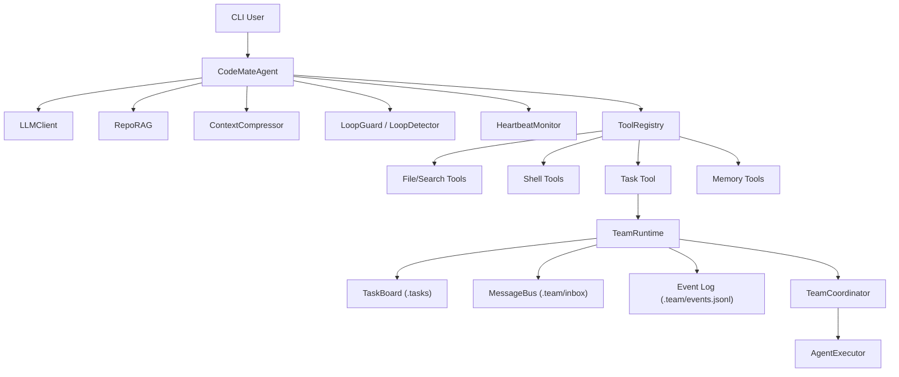

# CodeMate Agent

面向真实代码仓库的终端 AI 工程助手。  
核心目标不是“聊得好”，而是“能稳定把工程任务做完”。

## 项目定位

CodeMate 聚焦三件事：

- 可执行：LLM 决策与工具调用闭环，真正读写项目文件并推进任务。
- 可持续：长任务场景下，靠压缩与检索避免上下文崩塌。
- 可追溯：团队任务、事件、会话和关键决策都有落盘证据。

适用场景：

- 大仓库改造、跨文件重构、回归修复
- 需要“先调研 -> 再实现 -> 再验收”的工程流程
- 需要可恢复、可审计的 AI 协作执行链路

## 核心能力

### 1) Agent 执行闭环

- 原生 Function Calling（LLM -> Tool -> Result -> LLM）
- 参数校验与自动修复（避免空参数/错误格式循环）
- 连续失败与循环保护（LoopGuard + LoopDetector）
- 工具协议异常自动修复（MiniMax 协议链兼容处理）

### 2) 上下文与记忆工程

- Micro / Auto / Manual (`/compact`) 三层压缩
- RepoRAG 检索注入（memory + 根目录文档 + docs + 代码片段）
- 工具输出按类型截断（避免上下文被冗余输出占满）
- 会话与 transcript 落盘，支持历史回读

### 3) Team 模式

- 角色：`lead / researcher / builder / reviewer`
- 严格顺序（可开关）：`researcher -> builder -> reviewer`
- 任务板、请求跟踪、inbox、事件日志
- 委托执行与产物归档（`.team/artifacts`）

### 4) 可观测性

- 心跳与看门狗（超时告警）
- 结构化 trace 与 metrics
- CLI 可视化进度输出（阶段、行动、观察）

## 系统架构



## 快速开始

### 1. 安装依赖

```bash
git clone https://github.com/JackZhu001/CodeMate-Agent.git
cd CodeMate-Agent
pip install -r requirements.txt
```

### 2. 配置 `.env`

最小配置：

```bash
API_PROVIDER=minimax
API_KEY=your_api_key
MODEL=MiniMax-M2
BASE_URL=https://api.minimax.chat/v1
```

说明：

- 若使用 OpenAI 兼容网关，也可按你的网关地址配置 `BASE_URL`
- 可选配置轻量模型：`LIGHT_MODEL / LIGHT_API_KEY / LIGHT_BASE_URL`

### 3. 启动

```bash
python -m codemate_agent.cli
```

或：

```bash
./run.sh
```

## 常用命令

- `/help`：查看命令帮助
- `/reset`：重置当前会话状态
- `/init`：初始化项目记忆文件（`codemate.md`）
- `/compact`：手动触发上下文压缩
- `/rag <query>`：查看 RepoRAG 召回片段
- `/heartbeat`：查看心跳与超时状态
- `/team`：查看团队运行时状态
- `/inbox`：查看团队 inbox
- `/tasks`：查看任务板
- `/stats`：查看会话统计
- `/tools`：查看当前工具列表
- `/skills`：查看技能列表
- `/sessions`：查看历史会话索引
- `/history <id>`：加载历史会话
- `/memory`：查看长期记忆
- `/save`：持久化当前会话

## Team 模式示例

### 启用 Team 模式

```bash
export TEAM_AGENT_ENABLED=true
export TEAM_STRICT_MODE=true
export TEAM_AGENT_NAME=lead
export TEAM_AGENT_ROLE=lead
```

### 推荐委托方式

在 strict 模式下，`task` 工具建议显式指定 `agent_id`：

```text
task(agent_id="researcher", description="收集事实", prompt="阅读 README 和 docs")
task(agent_id="builder", description="实现页面", prompt="分块写入 docs/welcome.html")
task(agent_id="reviewer", description="一致性校验", prompt="检查标题与文档一致性")
```

## 关键环境变量

### 运行与模型

- `API_PROVIDER` / `API_KEY` / `MODEL` / `BASE_URL`
- `LIGHT_MODEL` / `LIGHT_API_KEY` / `LIGHT_BASE_URL`
- `MAX_ROUNDS`

### 压缩与上下文

- `CONTEXT_WINDOW`
- `COMPRESSION_THRESHOLD`
- `TOKEN_THRESHOLD`
- `MICRO_COMPACT_KEEP`
- `MICRO_SOFT_TRIM_RATIO`
- `MICRO_HARD_CLEAR_RATIO`

### RepoRAG

- `REPO_RAG_ENABLED`
- `REPO_RAG_TOP_K`
- `REPO_RAG_CHAR_BUDGET`
- `REPO_RAG_CODE_ENABLED`
- `REPO_RAG_CODE_ROOTS`
- `REPO_RAG_CODE_EXTENSIONS`

### Team 与观测

- `TEAM_AGENT_ENABLED`
- `TEAM_STRICT_MODE`
- `TEAM_GLOBAL_MAX_CONCURRENCY`
- `HEARTBEAT_ENABLED`
- `HEARTBEAT_TIMEOUT_SECONDS`
- `HEARTBEAT_POLL_SECONDS`

## 目录结构（核心）

```text
codemate_agent/
├── agent/          # 主循环、heartbeat、loop_guard、team_runtime
├── commands/       # CLI slash command 处理
├── context/        # 压缩与截断
├── llm/            # LLM 客户端与协议兼容
├── retrieval/      # RepoRAG + BM25
├── team/           # coordinator/executor/task board/inbox/protocol
├── tools/          # file/search/shell/task/memory/todo 等工具
├── skill/          # Skill 管理
└── ui/             # 终端显示与进度输出
```

## 测试与质量

运行全量测试：

```bash
pytest -q
```

启用仓库 hooks（可选）：

```bash
git config core.hooksPath .githooks
```

## 文档索引

- [项目报告](PROJECT_REPORT.md)
- [项目分析](PROJECT_ANALYSIS.md)
- [工作流说明](WORKFLOW.md)
- [记忆与上下文工程](docs/memory_context_design.md)

## 常见问题

### 1) `TEAM_STRICT_MODE` 下 lead 不能直接 `run_shell`/写文件

这是设计行为，不是 bug。  
strict 模式要求 lead 只负责调度，执行动作应委托给 team 成员。

### 2) MiniMax 偶发 500/520 或超时

框架已做多层重试和协议兼容降级，但上游服务波动仍可能导致中断。  
建议提高超时阈值并开启轻量模型分流，降低长链路失败概率。

### 3) 任务板看起来“历史任务很多”

`.tasks` 是持久化任务板，建议定期使用 `task_cleanup` 清理测试命名空间。

## 许可证

MIT
