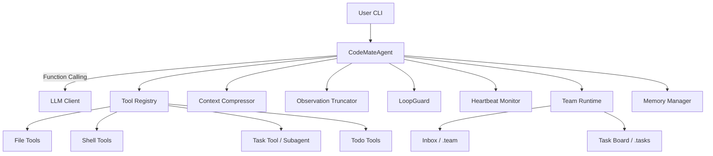

# CodeMate Agent

面向真实代码仓库的终端 AI 工程助手：能读、能查、能改、能追踪上下文。

## 设计目标

CodeMate 聚焦工程执行流，而不是一次性问答：
- **可执行**：围绕工具调用完成真实开发动作
- **可持续**：长链路任务不跑偏、不爆上下文
- **可追溯**：任务过程与工具结果可回溯

典型问题：
- “这个函数改哪里会影响线上？”
- “我刚刚跑过的命令输出去哪了？”
- “上周修过的问题还有记录吗？”

---

## ✨ 核心能力

- **Function Calling 原生闭环**：LLM → 工具 → 结果回写 → 再决策
- **三层上下文治理**：Micro / Auto / Manual `/compact`
- **工具输出智能截断**：按工具类型保留关键信息
- **心跳 + 看门狗**：长任务可观测、超时可告警
- **团队协作底座**：inbox + request 跟踪 + 任务板
- **子代理执行器**：受限工具的独立子会话
- **会话与记忆持久化**：历史可回读、状态可恢复

---

## 🧭 架构一览



---

## 🚀 快速开始

### 1) 安装依赖

```bash
git clone https://github.com/JackZhu001/CodeMate-Agent.git
cd CodeMate-Agent
pip install -r requirements.txt
```

### 2) 配置环境变量

创建 `.env`，至少包含：

```bash
API_PROVIDER=minimax
BASE_URL=https://api.minimax.chat/v1
API_KEY=your_api_key_here
MODEL=MiniMax-M2
```

### 3) 启动

```bash
python -m codemate_agent.cli
```

或使用脚本：

```bash
./run.sh
```

---

## ⚙️ 常用配置

| 变量 | 作用 | 默认值 |
| --- | --- | --- |
| `MODEL` | 模型名称 | `MiniMax-M2` |
| `API_PROVIDER` | 提供商 | `minimax` |
| `BASE_URL` | API 地址 | `https://api.minimax.chat/v1` |
| `CONTEXT_WINDOW` | 上下文窗口 | `200000` |
| `COMPRESSION_THRESHOLD` | 自动压缩阈值 | `0.75` |
| `MICRO_COMPACT_KEEP` | 微压缩保留最近轮数 | `3` |
| `MICRO_SOFT_TRIM_RATIO` | Soft Trim 比例 | `0.3` |
| `MICRO_HARD_CLEAR_RATIO` | Hard Clear 比例 | `0.5` |
| `MICRO_HARD_CLEAR_MIN_CHARS` | Hard Clear 最小可裁剪量 | `50000` |
| `HEARTBEAT_ENABLED` | 心跳开关 | `true` |
| `HEARTBEAT_TIMEOUT_SECONDS` | 超时告警阈值 | `45` |
| `TEAM_AGENT_ENABLED` | 团队运行时 | `false` |

更多细节见 `docs/memory_context_design.md`。

---

## 🖥️ CLI 命令

- `/help` 查看帮助
- `/reset` 重置会话
- `/init` 初始化项目记忆文件
- `/compact` 手动压缩上下文
- `/heartbeat` 查看心跳/看门狗状态
- `/team` 团队运行时状态
- `/inbox` 查看团队消息
- `/tasks` 查看任务板
- `/stats` 会话统计
- `/tools` 工具列表
- `/skills` 技能列表
- `/sessions` 会话列表
- `/history <id>` 加载历史会话
- `/memory` 查看长期记忆
- `/save` 保存会话

---

## 🧩 Skill 系统（渐进式加载）

Skill 采用三层加载：
1. **索引层**：只注入 name + description
2. **指令层**：触发后加载 `SKILL.md`
3. **引用层**：按需加载 `references/` 或 `scripts/`

这保证了大技能可用、上下文不爆。

---

## 🧠 记忆与上下文

- **短时记忆**：当前会话消息
- **工作记忆**：todo 状态 + 关键进度
- **长时记忆**：持久化会话与摘要

详见：`docs/memory_context_design.md`。

---

## 🧪 开发与测试

```bash
python -m pytest -q
```

启用预提交检查：

```bash
git config core.hooksPath .githooks
```

---

## 📁 项目结构（核心）

```
codemate_agent/
├── agent/                 # 主循环 + 运行时组件
│   ├── agent.py            # 主协调器
│   ├── heartbeat.py        # 心跳/看门狗
│   ├── loop_guard.py       # 失败纠偏/提前结束防护
│   └── team_runtime.py     # 团队运行时
├── context/                # 压缩与截断
├── tools/                  # 工具系统
│   └── task/               # 任务与子代理
├── team/                   # inbox / task board / event
├── skill/                  # Skill 管理
└── llm/                    # LLM 客户端
```

---

## 📚 文档

- [记忆与上下文工程](docs/memory_context_design.md)
- [工作流说明](WORKFLOW.md)
- [项目分析报告](PROJECT_ANALYSIS.md)
- [项目报告](PROJECT_REPORT.md)
- [代码审查报告](CODE_REVIEW_REPORT.md)

---

## 🖼️ 界面截图（按编号）

| 图 1：欢迎页与配置 | 图 2：会话交互 |
| --- | --- |
|  |  |

| 图 3：任务执行过程 | 图 4：项目介绍页展示 |
| --- | --- |
|  |  |

| 图 5：页面模块细节 | 图 6：页面模块细节 |
| --- | --- |
|  |  |

---

## 🗺️ Roadmap（节选）

- 工作记忆结构化固化（todo/阻塞/下一步）
- 会话摘要索引化（先召回摘要，再按需回读）
- 用户偏好画像文档化（类似 CLAUDE.md）

---

## 🙏 致谢

特别感谢 **HelloAgents（Datawhale）** 社区教程的启发。
同时也感谢借鉴过的工程思路：**Koder** 与 **OpenCode**。

[@DatawhaleChina](https://github.com/datawhalechina) ·
[@hello-agents](https://github.com/datawhalechina/hello-agents) ·
[@feiskyer/koder](https://github.com/feiskyer/koder) ·
[@anomalyco/opencode](https://github.com/anomalyco/opencode)

---

## 许可证

MIT
