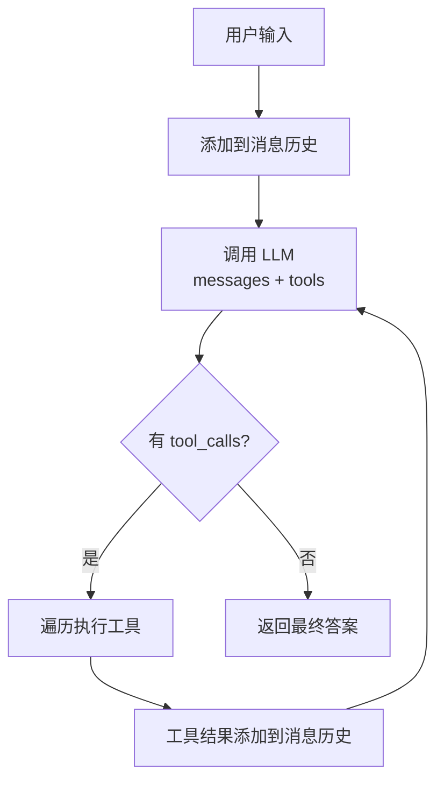

# CodeMate 工作流程详解

本文档详细说明 CodeMate Agent 的完整执行流程，包括每一步的参数传递和函数调用。

---

## 示例场景

**用户输入**: "这个项目有哪些文件？"

---

## 完整调用链

```
用户输入 "这个项目有哪些文件？"
        │
        ▼
┌─────────────────────────────────────────────────────────────┐
│  1. CLI 入口 (cli.py:95-116)                                │
├─────────────────────────────────────────────────────────────┤
│  user_input = "这个项目有哪些文件？"                         │
│  result = agent.run(user_input)                             │
└─────────────────────────────────────────────────────────────┘
        │
        ▼
┌─────────────────────────────────────────────────────────────┐
│  2. Agent.run() (agent.py:93-169)                           │
├─────────────────────────────────────────────────────────────┤
│  # 步骤 1: 添加用户消息到历史                                │
│  self.messages.append(Message(role="user", content=query))  │
│                                                             │
│  # 获取工具的 OpenAI Schema                                  │
│  tools = [t.to_openai_schema() for t in ...]                │
└─────────────────────────────────────────────────────────────┘
        │
        ▼
┌─────────────────────────────────────────────────────────────┐
│  3. LLM.complete() (llm/client.py:52-91)                    │
├─────────────────────────────────────────────────────────────┤
│  # 转换消息格式                                              │
│  api_messages = self._convert_messages(messages)            │
│                                                             │
│  # 构建请求参数                                              │
│  params = {                                                 │
│      "model": "glm-4-flash",                                │
│      "messages": api_messages,                              │
│      "tools": tools,  # ← 工具列表                          │
│  }                                                          │
│                                                             │
│  # 调用智谱 API                                             │
│  response = self.client.chat.completions.create(**params)  │
└─────────────────────────────────────────────────────────────┘
        │
        ▼
┌─────────────────────────────────────────────────────────────┐
│  4. _parse_response() 解析 API 返回                          │
├─────────────────────────────────────────────────────────────┤
│  # LLM 返回的内容类似：                                      │
│  # response.choices[0].message.content = ""                 │
│  # response.choices[0].message.tool_calls = [               │
│  #     ToolCall(                                            │
│  #         id="call_abc123",                                │
│  #         type="function",                                 │
│  #         function={                                       │
│  #             "name": "list_dir",                          │
│  #             "arguments": {"path": "."}                   │
│  #         }                                                │
│  #     )                                                    │
│  # ]                                                        │
│                                                             │
│  return LLMResponse(                                        │
│      content="",                                            │
│      tool_calls=[ToolCall(...)],                            │
│      finish_reason="tool_calls"                             │
│  )                                                          │
└─────────────────────────────────────────────────────────────┘
        │
        ▼
┌─────────────────────────────────────────────────────────────┐
│  5. 回到 Agent.run() 判断 (agent.py:149)                     │
├─────────────────────────────────────────────────────────────┤
│  if response.tool_calls:  # ← True!                         │
│      # 需要执行工具                                          │
└─────────────────────────────────────────────────────────────┘
        │
        ▼
┌─────────────────────────────────────────────────────────────┐
│  6. _execute_tool_call() (agent.py:171-196)                 │
├─────────────────────────────────────────────────────────────┤
│  tool_name = "list_dir"                                     │
│  arguments = {"path": "."}                                  │
│                                                             │
│  # 通过注册器执行                                            │
│  result = self.tool_registry.execute("list_dir", path=".")  │
└─────────────────────────────────────────────────────────────┘
        │
        ▼
┌─────────────────────────────────────────────────────────────┐
│  7. ToolRegistry.execute() (registry.py:81-116)             │
├─────────────────────────────────────────────────────────────┤
│  tool = self.get("list_dir")  # 获取 ListDirectoryTool      │
│                                                             │
│  # 执行工具                                                  │
│  return tool.run(path=".")                                  │
└─────────────────────────────────────────────────────────────┘
        │
        ▼
┌─────────────────────────────────────────────────────────────┐
│  8. ListDirectoryTool.run() (list_dir.py)                   │
├─────────────────────────────────────────────────────────────┤
│  # 实际执行 ls 命令                                         │
│  files = os.listdir(path)                                   │
│  return "codemate_agent/, examples/, tests/, ..."          │
└─────────────────────────────────────────────────────────────┘
        │
        ▼
┌─────────────────────────────────────────────────────────────┐
│  9. 将工具结果添加到消息历史 (agent.py:157-162)              │
├─────────────────────────────────────────────────────────────┤
│  self.messages.append(Message(                              │
│      role="tool",                                           │
│      content="codemate_agent/, examples/, ...",            │
│      tool_call_id="call_abc123",                            │
│      name="list_dir"                                        │
│  ))                                                         │
└─────────────────────────────────────────────────────────────┘
        │
        ▼
┌─────────────────────────────────────────────────────────────┐
│  10. 继续循环，再次调用 LLM (agent.py:124)                   │
├─────────────────────────────────────────────────────────────┤
│  # 这次 messages 包含：                                      │
│  # 1. system: 系统提示词                                     │
│  # 2. user: "这个项目有哪些文件？"                           │
│  # 3. assistant: [tool_calls: list_dir]                    │
│  # 4. tool: "codemate_agent/, examples/, ..."              │
│                                                             │
│  response = self.llm.complete(messages, tools)             │
└─────────────────────────────────────────────────────────────┘
        │
        ▼
┌─────────────────────────────────────────────────────────────┐
│  11. LLM 返回最终答案                                        │
├─────────────────────────────────────────────────────────────┤
│  # 这次 tool_calls = None                                   │
│  # content = "这个项目包含以下目录：..."                     │
│                                                             │
│  if response.tool_calls:  # ← False!                       │
│      return response.content  # ← 返回最终答案              │
└─────────────────────────────────────────────────────────────┘
        │
        ▼
┌─────────────────────────────────────────────────────────────┐
│  12. CLI 显示结果 (cli.py:119)                              │
├─────────────────────────────────────────────────────────────┤
│  console.print(Panel(result, ...))                          │
│                                                             │
│  ┌────────────────────────────────────┐                    │
│  │              答案                   │                    │
│  ├────────────────────────────────────┤                    │
│  │ 这个项目包含以下目录：              │                    │
│  │ - codemate_agent/  (核心代码)       │                    │
│  │ - examples/        (示例)           │                    │
│  │ - tests/           (测试)           │                    │
│  └────────────────────────────────────┘                    │
└─────────────────────────────────────────────────────────────┘
```

---

## 关键数据结构变化

### 消息历史 (`self.messages`) 的变化过程

```python
# 初始状态
self.messages = [
    Message(role="system", content="你是 CodeMate...可用工具:\n- list_dir: ...\n- read_file: ...")
]

# 第 1 轮：添加用户输入
self.messages = [
    Message(role="system", ...),
    Message(role="user", content="这个项目有哪些文件？")
]

# 第 1 轮：LLM 返回工具调用
self.messages = [
    Message(role="system", ...),
    Message(role="user", content="这个项目有哪些文件？"),
    Message(
        role="assistant",
        content="",
        tool_calls=[
            ToolCall(
                id="call_abc123",
                type="function",
                function={"name": "list_dir", "arguments": {"path": "."}}
            )
        ]
    )
]

# 第 1 轮：工具执行结果
self.messages = [
    Message(role="system", ...),
    Message(role="user", content="这个项目有哪些文件？"),
    Message(role="assistant", "", tool_calls=[...]),
    Message(
        role="tool",
        content="codemate_agent/, examples/, tests/, ...",
        tool_call_id="call_abc123",
        name="list_dir"
    )
]

# 第 2 轮：LLM 返回最终答案
# response.tool_calls = None
# return response.content
```

---

## 发送给 LLM 的实际数据

### 请求参数

```python
{
    "model": "glm-4-flash",
    "messages": [
        {"role": "system", "content": "你是 CodeMate..."},
        {"role": "user", "content": "这个项目有哪些文件？"}
    ],
    "tools": [
        {
            "type": "function",
            "function": {
                "name": "list_dir",
                "description": "列出目录内容",
                "parameters": {
                    "type": "object",
                    "properties": {
                        "path": {"type": "string", "description": "目录路径"}
                    },
                    "required": ["path"]
                }
            }
        },
        # ... 其他工具
    ]
}
```

### LLM 返回（第 1 轮 - 工具调用）

```python
{
    "choices": [{
        "message": {
            "content": "",
            "tool_calls": [{
                "id": "call_abc123",
                "type": "function",
                "function": {
                    "name": "list_dir",
                    "arguments": '{"path": "."}'
                }
            }]
        },
        "finish_reason": "tool_calls"
    }],
    "usage": {
        "prompt_tokens": 350,
        "completion_tokens": 25,
        "total_tokens": 375
    }
}
```

### LLM 返回（第 2 轮 - 最终答案）

```python
{
    "choices": [{
        "message": {
            "content": "这个项目包含以下目录：\n- codemate_agent/ (核心代码)\n- examples/ (示例项目)\n...",
            "tool_calls": None
        },
        "finish_reason": "stop"
    }],
    "usage": {...}
}
```

---

## 核心函数签名

| 函数 | 输入 | 输出 | 位置 |
|------|------|------|------|
| `agent.run(query)` | 用户问题字符串 | 最终答案字符串 | `agent.py:93` |
| `llm.complete(messages, tools)` | Message[], dict[] | LLMResponse | `client.py:52` |
| `registry.execute(name, **kwargs)` | 工具名, 参数 | 结果字符串 | `registry.py:81` |
| `tool.run(**kwargs)` | 工具参数 | 结果字符串 | 各工具文件 |

---

## Agent 核心循环流程图


